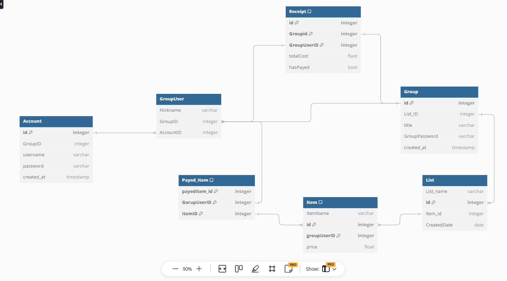

# Roommate App Project

## Authors
- Zachary Howe
- Rathang Pandit
- Lucia Mora
- Barbara Hernandez

## Table of Contents
- [Milestone 1](#milestone-1) - Pages 2-3
- [Milestone 2](#milestone-2) - Pages 4-5
- [Milestone 3](#milestone-3) - Page 6

---

## Milestone 1
### Goal
The goal of this project is to create a roommate app that appropriately separates the costs of living with each other and splits those costs evenly so people can pay throughout the month. The app allows people in real time to connect a group through a username and login. It features real-time updating lists through a database, allowing for data to exist and update instantly. Roommates will have the option to opt into certain purchases within a specific list in their group, creating receipts to reduce issues and disagreements.

### Challenges and Solutions
1. **Database with Listeners:**
   - The database must support real-time updates and work with iOS and SwiftUI.
   - **Solution:** Initially considered PostgreSQL, but Firebase was chosen due to its ease of use and compatibility with the team’s needs.

2. **Access to Macs:**
   - Most team members do not own Macs, and library Macs were not functional.
   - **Solution:** The Maker Space provided Macs with Xcode access via a special password. As long as we claimed we were from a different engineering class.

### Proposal Features
- Login and authentication
- Real-time updating UI
- Integration with a database (Firebase or PostgreSQL)
- Real-time database listeners for UI updates
- Friend invitations for app usage
- Monthly cost calculation and automated delivery
- Simple, user-friendly UI design

---

## Milestone 2
### Wireframes and Diagrams
- Wireframes were hand-drawn, making them difficult to showcase clearly.
- A database diagram was created using [dbdiagram.io](https://dbdiagram.io).

  

### Features and Development Plan
All proposed features were deemed **must-haves**. Each team member allocated approximately 10 hours for feature development and an additional 10 hours for debugging.

### Time Estimates and Designation
| Feature                                             | Hours | Contributors                   |
|-----------------------------------------------------|-------|--------------------------------|
| Login and authentication (Swift & Database)         | 10    | Everyone                       |
| Real-time updating UI                               | 10    | Everyone                       |
| Database implementation (Firebase or PostgreSQL)    | 10    | Zachary Howe                   |
| Real-time database listeners                        | 10    | Zachary Howe, Rathang Pandit   |
| Create group page                                   | 5     | Barbara Hernandez              |
| Create list page                                    | 5     | Lucia Mora                     |
| UI design for remaining pages                       | 20    | Barbara Hernandez, Lucia Mora  |

### Additional Features
- **Added Optional:** Integrate Apple’s camera receipt reader to speed up list creation. If there is time.

---

## Milestone 3
### Status
All must-have features have been implemented.

### Issues Encountered
1. **Mac Availability:** Finding available computers in the Maker Space was challenging.
2. **Database Choice:** Originally used PostgreSQL, but switched to Firebase for better compatibility with SwiftUI and availability of tutorials.
3. ** UI And Database** Trying to maintain the design of the UI posed difficulties when trying to integrate the listeners and database.

### Recap and Learning
This experience enhanced our understanding of app development using SwiftUI and Firebase. We learned to utilize modern iOS 16 features effectively and avoid deprecated practices.

### Testing the App
To test the app, please contact **Zachary Howe**:
- **Email:** [Zacharyh777@gmail.com](mailto:Zacharyh777@gmail.com)
- **ID:** 923229694

> **Note:** The database must be manually activated due to cost constraints. Please reach out before testing. Sorry for the incovinience.

---

**Thank you for reviewing our project!**

---

### Credits

-- SwiftUI X Firebase Documentation Help
- https://www.youtube.com/watch?v=QCKrZ0rFu8c -- basics
- https://www.youtube.com/watch?v=6b2WAePdiqA -- signup, auth, etc...
- https://www.youtube.com/watch?v=G0AyApE2w1c -- Snapshot Listener help

--  Swift UI
- https://www.youtube.com/watch?v=F3LziFHJGUo -- tables recap and help
- https://www.youtube.com/watch?v=GZ-hQWMjT0s -- helped us with navigation errors

-- Markdown Help
- https://coding-boot-camp.github.io/full-stack/github/professional-readme-guide -- Markdown help

